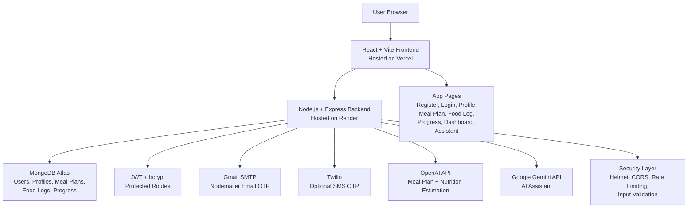

# NutriAI Diet Planner

NutriAI is a full-stack medical-condition-aware personalised diet planning application. The project helps users create a health profile, generate meal plans based on their goal and medical conditions, log actual food intake, estimate nutrition values from food quantity, track progress, and ask nutrition-related questions through an in-app AI assistant. The application was built as a practical MERN-style project with secure authentication, AI integration, dashboard visualisation, and production deployment.

The main idea behind NutriAI is to go beyond a normal calorie tracker. Instead of only asking for calories or weight, the application considers dietary preference, health goals, body metrics, and conditions such as acidity/GERD, IBS, type 2 diabetes, high cholesterol, hypertension, lactose intolerance, gluten intolerance, PCOS, and thyroid-related issues. Meal plans and supplement suggestions are educational only and should be checked with a doctor, pharmacist, or registered dietitian before being followed.

## Live Project Links

The frontend is deployed on Vercel and can be opened here:

```text
https://diet-planner-silk.vercel.app
```

The backend is deployed on Render and can be checked here:

```text
https://diet-planner-dyot.onrender.com
```

The backend health check endpoint is:

```text
https://diet-planner-dyot.onrender.com/health
```

The production API base URL used by the frontend is:

```text
https://diet-planner-dyot.onrender.com/api
```

## Main Features

NutriAI includes secure user registration and login. During registration, the user enters their name, email address, optional phone number, and password. The backend validates the input, hashes the password, creates an OTP, and sends the OTP to the user's email address through Gmail SMTP using Nodemailer. The user must verify the OTP before accessing the private areas of the application. The login flow uses JWT tokens, and optional SMS OTP support is included through Twilio.

The health profile feature allows the user to save important nutrition-related details such as age, gender, weight, height, goal, dietary preference, and medical conditions. The backend calculates BMI and target calories from this profile, and the saved profile becomes the foundation for meal plan generation, dashboard summaries, and AI assistant context.

The meal plan feature generates a full daily meal plan with breakfast, snacks, lunch, and dinner. Each meal includes ingredients, calories, macronutrients, key nutrients, preparation tips, and recipe steps. The plan also includes foods to avoid, condition-specific guidance, and supplement suggestions. The supplement information is written carefully as educational guidance and includes advice to check with a qualified professional.

The food log feature allows users to record what they actually ate. A nutrition estimation feature predicts calories, protein, carbohydrates, and fat from food items and quantity. If OpenAI is configured, the app can use AI for smarter estimates. If the AI service is not available, the backend can fall back to a small built-in nutrition table for common foods.

The dashboard brings together profile data, meal plans, food logs, and progress records. It displays useful summaries such as calories consumed against target, weight trend, meal plan adherence, recent food logs, and condition-specific tips. Recharts is used to create clear visual charts.

The AI assistant allows users to ask questions about meal planning, safer food swaps, supplement cautions, and nutrition choices. The assistant uses Gemini and is prompted to avoid diagnosis, prescriptions, and unsafe medical claims. It reminds users to speak to a doctor, pharmacist, or registered dietitian for medical decisions.

## Tech Stack

The frontend is built with React, Vite, Tailwind CSS, React Router, Axios, Recharts, React Hot Toast, and Lucide React. React provides the component structure, Vite handles development and production builds, Tailwind CSS provides styling, React Router manages page navigation, Axios handles HTTP requests, Recharts powers dashboard charts, and Lucide React provides icons.

The backend is built with Node.js, Express, MongoDB Atlas, Mongoose, bcryptjs, JSON Web Tokens, express-validator, express-rate-limit, Helmet, CORS, Nodemailer, and Twilio. Express provides the REST API, Mongoose models the database, bcryptjs protects passwords, JWT secures private routes, validation and rate limiting improve security, and Nodemailer/Twilio support OTP verification.

AI and cloud services include OpenAI for meal plan generation and nutrition estimation, Gemini for the AI assistant, MongoDB Atlas for the production database, Render for backend hosting, and Vercel for frontend hosting.


## Architecture Diagram



## Local Project Setup

To run the project locally, first clone the repository and open the project folder.

```bash
git clone https://github.com/deekshith2204/Diet-planner.git
cd Diet-planner
```

Install the backend dependencies from the `server` folder.

```bash
cd server
npm install
```

Create a backend `.env` file from the example file.

```bash
copy .env.example .env
```

On macOS or Linux, use:

```bash
cp .env.example .env
```

Add your own local environment values in `server/.env`. Do not commit real credentials to GitHub.

```env
NODE_ENV=development
PORT=5000
MONGO_URI=mongodb://127.0.0.1:27017/nutriai
CLIENT_URL=http://localhost:5173
JWT_SECRET=replace-with-a-long-random-secret
JWT_EXPIRES_IN=1d

GMAIL_USER=your_gmail_address
GMAIL_APP_PASSWORD=your_gmail_app_password

OPENAI_API_KEY=your_openai_key
OPENAI_MODEL=gpt-4o-mini

GEMINI_API_KEY=your_gemini_key
GEMINI_MODEL=gemini-2.0-flash

TWILIO_ACCOUNT_SID=your_twilio_account_sid
TWILIO_AUTH_TOKEN=your_twilio_auth_token
TWILIO_PHONE_NUMBER=your_twilio_phone_number
```

Start the backend server.

```bash
npm run dev
```

In a second terminal, install the frontend dependencies from the `client` folder.

```bash
cd client
npm install
```

Create a frontend `.env` file if needed and add the local API URL.

```env
VITE_API_URL=http://localhost:5000/api
```

Start the frontend development server.

```bash
npm run dev
```

The local frontend should run at:

```text
http://localhost:5173
```

The local backend should run at:

```text
http://localhost:5000
```

The local backend health endpoint is:

```text
http://localhost:5000/health
```


```


## Deployment Setup

The backend is deployed on Render. The Render service should use `server` as the root directory, `npm install` as the build command, and `npm start` as the start command. The health check path should be `/health`. Production environment variables such as `ATLAS_URI`, `JWT_SECRET`, `CLIENT_URL`, Gmail credentials, OpenAI key, Gemini key, and Twilio credentials should be added in the Render dashboard.

The frontend is deployed on Vercel. The Vercel project should use `client` as the root directory, `npm run build` as the build command, and `dist` as the output directory. The production environment variable `VITE_API_URL` should point to the Render backend API:

```env
VITE_API_URL=https://diet-planner-dyot.onrender.com/api
```

After changing environment variables on Render or Vercel, redeploy the affected service so the new values are used.

## Security Notes

NutriAI uses bcrypt password hashing, JWT authentication, OTP verification, request validation, rate limiting, Helmet security headers, CORS configuration, and environment variables for sensitive data. Real API keys, passwords, database URLs, and Gmail app passwords should never be committed to GitHub.

If a secret is accidentally committed or pasted publicly, it should be rotated immediately. This is especially important for MongoDB Atlas passwords, Gmail app passwords, Twilio tokens, OpenAI keys, and Gemini keys.


## Reffrences

React documentation: https://react.dev/learn

Vite documentation: https://vite.dev/guide/

Express documentation: https://expressjs.com/

MongoDB Atlas documentation: https://www.mongodb.com/docs/atlas/

Mongoose documentation: https://mongoosejs.com/docs/

OpenAI API: https://openai.com/api/

Gemini API: https://ai.google.dev/gemini-api/docs

Render documentation: https://render.com/docs

Vercel documentation: https://vercel.com/docs

OWASP Authentication Cheat Sheet: https://cheatsheetseries.owasp.org/cheatsheets/Authentication_Cheat_Sheet.html
